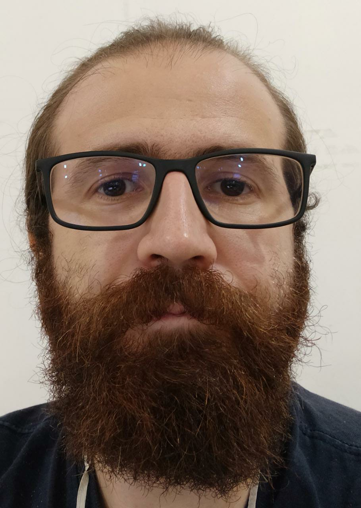

<html xmlns="http://www.w3.org/1999/xhtml">
<head>
  <meta http-equiv="Content-Type" content="text/html; charset=UTF-8" />
  <link rel="stylesheet" type="text/css" href="style.css" />
</head>
  

<body>

/>

<a href="index.html.en">English Version</a>

<h1>Diego Pedro</h1>

Sou professor no <a href="http://www2.ifam.edu.br/">Instituto Federal de Ciência e Tecnologia do Amazonas - IFAM</a> lotado na cidade de <a href="https://amazonasatual.com.br/wp-content/uploads/2019/05/FOTO.13.jpg">São Gabriel da Cachoeira</a>  em processo de remoção para o campus de Parintins. Atualmente curso mestrado em Computação na<a href="https://www.icmc.usp.br/pos-graduacao/ppgccmc"> USP - São Carlos </a> sob orientação do Professor <a href="https://sites.google.com/view/taspardo/">Dr. Thiago pardo </a>

<h2>Área de pesquisa</h2>

Meu trabalho reside na interseção entre psicologia, linguística, filosofia e computação no desenvolvimento de agentes conversacionais. Busco hipóteses e teorias do comportamento e desenvolvimento humano, filosofia da mente, evolução da linguagem, acquisição da linguagem que possam contribuir para agentes conversacionais mais eficientes.

<h2>Ensino</h2>
<h3>Disciplinas ministradas em 2022</h3>
       
<ul class="topics">
  <li><b>Projeto integrador</b>  
  Técnico integrado em informática,IFAM</li>  
  <li><b>Programação orientada a objetos</b> 
  Técnico integrado em informática,IFAM</li>   
  <li><b>Montagem e Manutenção de Computadores.</b>  
  Técnico integrado em informática,IFAM</li>  
  <li><b>Introdução a Sistemas de Informação</b>  
  Técnico integrado em secretariado escolar,IFAM</li>  
  <li><b>Tópicos especiais em informática</b> 
  Técnico subsequente em administração,IFAM</li>  
</ul>

<h3>Disciplinas ministradas em 2021</h3>
       
<ul class="topics">
  <li><b>Lógica de programação e estrutura de dados</b>  
  Técnico integrado em informática,IFAM</li>  
  <li><b>Programação orientada a objetos</b> 
  Técnico integrado em informática,IFAM</li>   
  <li><b>Montagem e Manutenção de Computadores.</b>  
  Técnico integrado em informática,IFAM</li>  
  <li><b>Análise de Sistemas</b> 
  Técnico subsequente em informática,IFAM</li>   
</ul>
       
       
<h3>Disciplinas ministradas em 2020</h3>
       
<ul class="topics">
  <li><b>Lógica de programação e estrutura de dados</b> 
  Técnico integrado em informática,IFAM</li>  
  <li><b>Programação orientada a objetos</b> 
  Técnico integrado e subsequente em informática,IFAM</li>  
  <li><b>Montagem e Manutenção de Computadores.</b>
  Técnico integrado e subsequente em informática,IFAM</li>  
  <li><b>Análise de Sistemas</b>
  Técnico Subsequente em informática,IFAM</li>  
  <li><b>Informática básica</b>
  Técnico Subsequente em Secretariado escolar,IFAM</li>  
  <li><b>Sistemas Operacionais</b>
  Técnico Subsequente em informática,IFAM</li> 
</ul>
       
<h3>Disciplinas ministradas em 2019</h3>
       
<ul class="topics">
  <li><b>Estrutura de dados</b> 
  Técnico integrado em informática,IFSUL</li>
  <li><b>Informática Básicas</b> 
  Técnico integrado em plástico e Eventos,IFSUL</li>
  <li><b>Projetos de Sistemas</b>
  Técnico integrado em informática,IFSUL</li> 
  <li><b>Sistemas Operacionais</b>
  Técnico integrado em informática,IFSUL</li> 
</ul>

<h3>Disciplinas ministradas em 2018</h3>
       
<ul class="topics">
  <li><b>Estrutura de dados</b>
  Técnico integrado em informática,IFSUL</li> 
  <li><b>Linguagem de Programação III</b> 
  Técnico integrado em informática,IFSUL</li>
  <li><b>Engenharia de Software</b>
  Técnico integrado em informática,IFSUL</li>
  <li><b>Projeto de Sistemas</b> 
  Técnico integrado em informática,IFSUL</li>
  <li><b>Sistemas Operacionais</b>
  Técnico integrado em informática,IFSUL</li> 
</ul>

<h3>Disciplinas ministradas em 2017</h3>
       
<ul class="topics">
  <li><b>Estrutura de dados</b>
  Técnico integrado em informática,IFSUL</li>
  <li><b>Informática Básica</b> 
  Proeja,IFSUL</li>
</ul>

<h2>Extensão</h2>
  
<h3>Projeto olímpico</h3> 
  Treinamento de alunos do ensino médio para a olimpíada Brasileira de informática. Com os seguintes resultados obtidos até o momento
  
  <ul class="topics">
  <li><b>2018</b> 
    <a href="site">Melhor resultado de uma escola de nível médio do Rio Grande do sul com 7 alunos classificados para a final nacional</a>
    <a href="site">Programação Nível Senior: Carlos Fabiano Renner - Honra ao Mérito </a>
    </li>
  <li><b>2019</b> 
    <a href="site">Melhor resultado de uma escola de nível médio do Rio Grande do sul com 4 alunos classificados para a final nacional</a>
    </li>
   <li><b>2021</b> 
    <a href="site">Segundo melhor resultado de um campus do IFAM do interior </a>
    </li>
     <li><b>2022</b> 
    <a href="site">Melhor resultado da história do IFAM no nível P1 a qual o aluno Eduardo Fabrício obteve o 106 lugar no Brasil </a>
    Único estudante do IFAM classificado para a final nacional nível P1 </a>
    Melhor resultado do IFAM considerando todos os níveis </a>
    </li>
</ul>
  
  

Última atualização: 15 de Junho, 2022.

